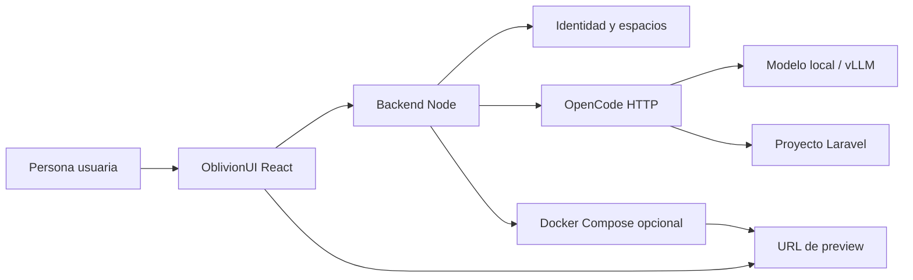

# Arquitectura e integración

## Componentes

El frontend está en `src/` y usa React, TypeScript, Vite, Tailwind y componentes shadcn/ui. El
backend `server.mjs` sirve los archivos compilados, expone `/health` y protege la API. `opencode.mjs`
es el adaptador HTTP; concentra las diferencias entre OblivionUI y la API de OpenCode.

## Identidad y aislamiento

`identity.mjs` guarda usuarios, espacios y membresías en un JSON local del servidor. Las
contraseñas se derivan con `scrypt`; nunca se devuelven al navegador. Las sesiones HTTP son
cookies `HttpOnly`, de doce horas y `SameSite=Strict`.

Una conexión OpenCode contiene la cuenta y espacio que la creó. Cada petición verifica esa
relación antes de usar la conexión. Las credenciales de OpenCode no se persisten al disco.

Esto es una base de instalación interna, no un proveedor de identidad corporativo. Para SSO,
recuperación de contraseña, auditoría o alta masiva, integra un proveedor de identidad y una base
de datos antes de usarlo con información sensible.

## Proyecto y persistencia

`src/store.ts` conserva fichas, mensajes y versiones en `localStorage`, con una clave distinta
por cuenta y espacio. El código y las sesiones reales viven donde los maneja OpenCode. La siguiente
etapa debe introducir una API de proyectos y almacenamiento compartido para colaboración entre
navegadores.

## Contrato de OpenCode utilizado

El adaptador comprueba salud y directorio, crea sesiones, envía mensajes y consulta:

- contexto permitido del proyecto;
- permisos y preguntas pendientes;
- historial de mensajes;
- recuperación y deshacer recuperación.

Una versión de OpenCode puede no implementar alguna capacidad. El adaptador responde con un
estado explícito para que la interfaz no prometa funciones inexistentes. Mantén las pruebas de
`opencode.test.mjs` y `server.test.mjs` al actualizar OpenCode.

## Archivos importantes

| Archivo | Responsabilidad |
| --- | --- |
| `server.mjs` | API HTTP, cookies, rutas y control de acceso. |
| `identity.mjs` | Usuarios, roles, espacios y contraseña derivada. |
| `opencode.mjs` | Cliente y validaciones para la API de OpenCode. |
| `provision.mjs` | Copia aislada de la plantilla Laravel. |
| `runtime.mjs` | Inicio y detención del Compose de cada proyecto. |
| `src/App.tsx` | Navegación, acceso, registro, alta y configuración. |
| `src/Workspace.tsx` | Conversación, preview, pendientes e historial. |

## Pruebas

`npm test` ejecuta pruebas unitarias y una integración local del backend contra un OpenCode
simulado. No necesita Docker ni un modelo. `npm run typecheck` valida TypeScript y `npm run build`
comprueba el empaquetado de producción.
